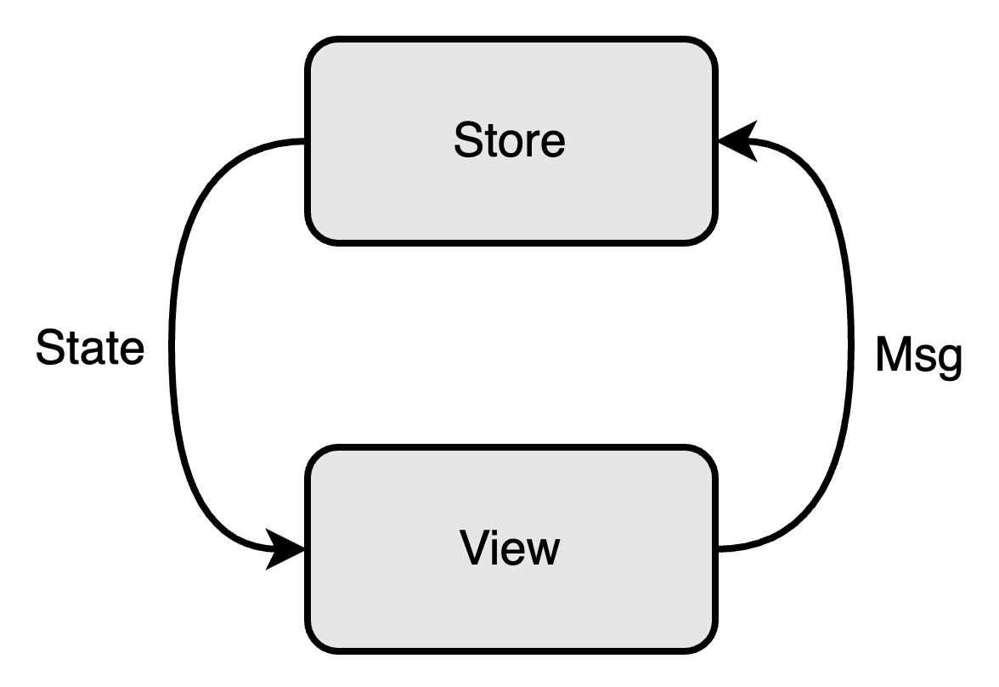
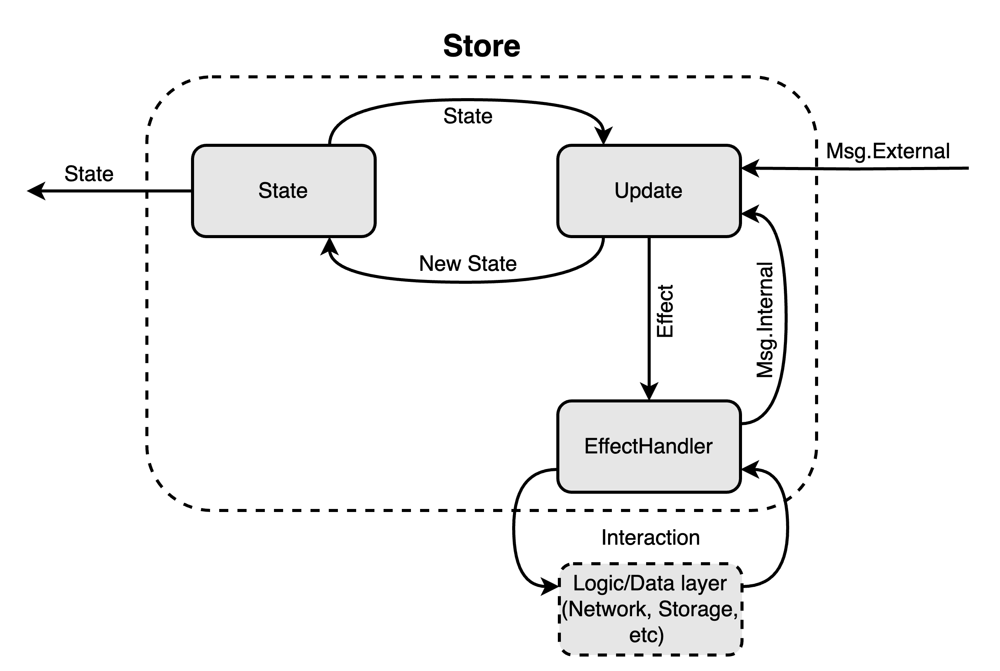
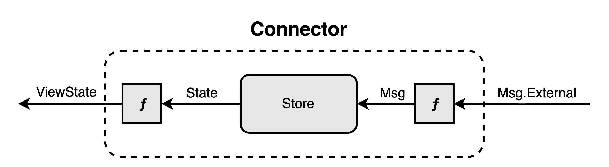
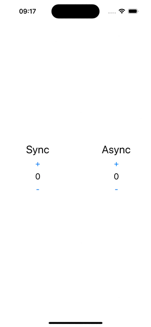

[](https://opensource.org/licenses/Apache-2.0)


# Overview
## What is The Elm Architecture
The Elm Architecture ([Elm Architecture](https://guide.elm-lang.org/architecture/)) is a popular software architecture pattern used in the 
Elm programming language. It provides a structure for development based on functional programming and a unidirectional data flow.


The Elm Architecture consists of three main components:
- `Model` This is the application state that contains all the data needed for its functioning. The model is immutable and is updated only 
through messages (`Msg`).
- `Update` This is a function that takes the current model and a message and returns a new model. It is responsible for handling messages 
and updating the application state.
- `View` This is a function that takes the current model and returns the user interface. The view displays data from the model and reacts 
to user actions by generating new messages.

The Elm Architecture provides a clear separation between the application logic and its presentation, making the code more understandable, 
modular, and easily testable. It also ensures error resilience and prevents many common problems associated with mutable state and side 
effects.



## What is Keemun
Keemun is a multiplatform Kotlin framework that provides a way to write shared code using The Elm Architecture pattern.




# Installation
## CocoaPods
[CocoaPods](http://cocoapods.org/) is a dependency manager for Cocoa projects. You can install it with the following command:

```bash
$ gem install cocoapods
```

To integrate Keemun into your Xcode project using CocoaPods, specify it in your `Podfile`:

```ruby
pod 'Keemun', '1.0.0'
```

Then, run the following command:

```bash
$ pod install
```

## Swift Package Manager

The [Swift Package Manager](https://swift.org/package-manager/) is a tool for automating the distribution of Swift code and is integrated into the `swift` compiler.

Once you have your Swift package set up, adding Keemun as a dependency is as easy as adding it to the `dependencies` value of your `Package.swift`.


```swift
dependencies: [
    .package(url: "https://github.com/pavelannin/Keemun-Swift.git", from: "1.0.0")
]
```


# Componets
## State
`State` is a class that describes the state of your application/feature/screen/view/etc. at a specific moment in time.

## Start
`Start` is the place for initialization. Its method returns the initializing `state` and the initial set of side-effects.

## Msg
Any `Msg` represents an intention to change the state. `Msg` is sent from the user interface/business logic.

## Update
`Update` is the place for logic. Its method takes `state` and `msg` as arguments and returns a new `state` and a collection of `effects`. 
The idea is to be a pure function that modifies the `state` and sends an side-effect according to the received `message` and the current 
`state`.

## Effect
Any `Effect` represents an intention to invoke part of your business logic. `Effect` is sent from the update depending on the received 
message.

## EffectHandler
`EffectHandler` is the place where business logic is executed. Its method takes `effect` and `dispatch` as arguments. The idea is to be a 
function that sends messages to `dispatch` according to the received effect and performs the operation. `EffectHandler` is a 
suspend function, and each effect is executed in a separate coroutine.

## Connector
`Connector` is an entity that holds an instance of `Store`.

## StoreParams
`StoreParams` is a container that holds `Start`, `Update`, and `EffectHandler` in one place for creating a `Store`. 
`StoreParams` provides several convenient overridden functions for creating it with optional arguments.

## FeatureParams
`FeatureParams` is a container that holds `StoreParams`, a function for transforming `State` into `ViewState`, and other parameters 
required for creating a `Connector`. `FeatureParams` provides several convenient overridden functions for creating it with optional 
arguments.

# Example

## Creating StoreParams

```swift
struct CounterStoreParams: StoreParams, MsgSplitable {
    typealias Msg = SplitMsg<ExternalMsg, InternalMsg>

    func start() -> Start<Self> {
        .next(
            .init(
                syncCount: 0,
                asyncCount: 0,
                isAsyncRunning: false
            )
        )
    }

    static func externalUpdate(for msg: ExternalMsg, state: State) -> Update<Self> {
        switch msg {
        case .incrementSync:
            return .next(state) { $0.syncCount = $0.syncCount + 1 }
        case .decrementSync:
            return .next(state) { $0.syncCount = $0.syncCount - 1 }
        case .incrementAsync:
            return .next(state, effect: .increment(state.asyncCount)) { $0.isAsyncRunning = true }
        case .decrementAsync:
            return .next(state, effect: .decrement(state.asyncCount)) { $0.isAsyncRunning = true }
        }
    }

    static func internalUpdate(for msg: InternalMsg, state: State) -> Update<Self> {
        switch msg {
        case .completedAsyncOperation(let newValue):
            return .next(state) {
                $0.asyncCount = newValue
                $0.isAsyncRunning = false
            }
        }
    }

    func effectHandler(for effect: Effect, dispatch: @escaping InternalDispatch) async {
        switch effect {
        case .increment(let value):
            try! await Task.sleep(for: .seconds(1))
            dispatch(.completedAsyncOperation(value + 1))
        case .decrement(let value):
            try! await Task.sleep(for: .seconds(1))
            dispatch(.completedAsyncOperation(value - 1))
        }
    }

    struct State {
        var syncCount: Int
        var asyncCount: Int
        var isAsyncRunning: Bool
    }

    enum ExternalMsg {
        case incrementSync
        case decrementSync
        case incrementAsync
        case decrementAsync
    }

    enum InternalMsg{
        case completedAsyncOperation(Int)
    }

    enum Effect {
        case increment(Int)
        case decrement(Int)
    }
}
```

## Creating FeatureParams

```swift
struct CounterFeatureParams: FeatureParams {
    typealias SParams = CounterStoreParams

    func stateTransform(_ state: CounterStoreParams.State) -> ViewState {
        ViewState(
            syncCount: String(state.syncCount),
            asyncCount: String(state.asyncCount),
            isAsyncRunning: state.isAsyncRunning
        )
    }

    struct ViewState {
        let syncCount: String
        let asyncCount: String
        let isAsyncRunning: Bool
    }
}
```

## Usage in UI layer
```swift
struct CounterFeatureView: View {
    @ObservedObject private var connector: KeemunConnector<CounterFeatureParams>

    init(_ connector: KeemunConnector<CounterFeatureParams>) {
        self.connector = connector
    }

    var body: some View {
        MainView(
            state: connector.state,
            syncIncrementAction: { connector.dispatch(.incrementSync) },
            syncDecrementAction: { connector.dispatch(.decrementSync) },
            asyncIncrementAction: { connector.dispatch(.incrementAsync) },
            asyncDecrementAction: { connector.dispatch(.decrementAsync) }
        )
    }
}

private struct MainView: View {...}
```

## Creating a connector instance

```swift
let connector = CounterFeatureParams().makeConnector(CounterStoreParams())
CounterFeatureView(connector)
```

# Sample project
The sample project is a screen with two counters: synchronous and asynchronous. The synchronous counter is modified in `Update`, 
demonstrating state changes, while the asynchronous counter is modified in `EffectHandler`, simulating asynchronous business logic. 

## Screenshots
